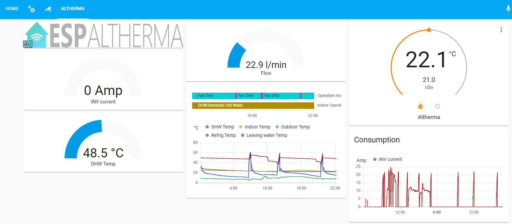
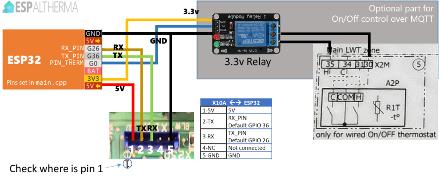
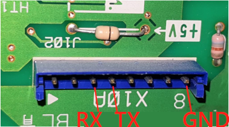
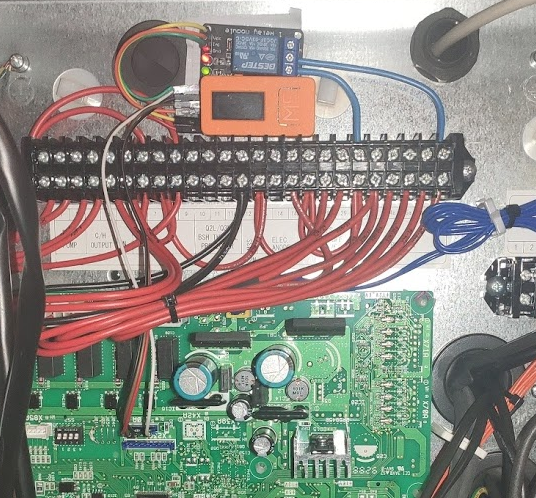
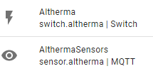
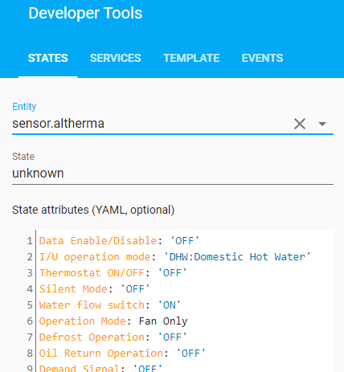
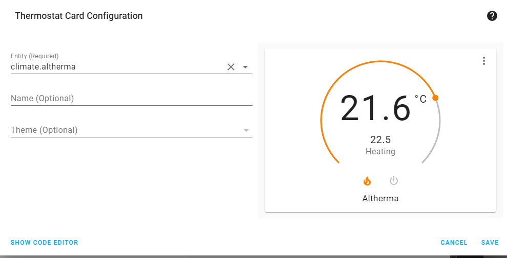

<hr/>

<p align="center">
<a href="https://travis-ci.com/raomin/ESPAltherma"></a>
&nbsp;

&nbsp;

&nbsp;
<a href="https://github.com/sponsors/raomin/"></a>
&nbsp;
<a href="https://www.buymeacoffee.com/raomin" target="_blank"></a>
</p>

<hr/>

<p><b>ESPAltherma</b> is a solution to monitor Daikin Altherma / ROTEX / HOVAL Belaria heat pump activity using just Arduino on an <b>ESP32</b> or <b>ESP8266</b> Microcontroller.</p>

_If this project has any value for you, please consider [buying me a 🍺](https://www.buymeacoffee.com/raomin) or even better [sponsoring ESPAltherma](https://github.com/sponsors/raomin/)!. I don't do this for money but it feels good to get some support! Thanks :)_ 

## Features

  <ul style="list-style-position: inside;">
    <li>Connects with the serial port of Altherma on port X10A.</li>
    <li>Needs just an ESP32, no need for extra hardware. ESP8266 is also supported.</li>
    <li>Queries the Altherma for selected values at defined interval.</li>
    <li>Converts and formalizes all values in a JSON message sent over MQTT.</li>
    <li>Easily integrates with Home Assistant's MQTT auto-discovery.</li>
    <li>Supports update OverTheAir</li>
    <li>Log messages in Serial + MQTT + Screen (m5StickC)</li>
    <li>Optional: can control (on/off) your heat pump.</li>
</ul>

## Preview



# Prerequisites

## Hardware

- A Daikin Altherma or Daikin Altherma based heat pump (ROTEX, HOVAL Belaria...)
- An ESP32 or ESP8266 *I recommend an ESP32, more precisely the M5StickC, it has an integrated display, a magnet, fits well next to the board and is properly isolated. But any ESP32 should work. A support is added for esp8266.*
- 5 pins JST EH 2.5mm connector (or 4 Dupont wires M-F)

## Software

- Platformio

*That's all!*

# Getting started

## Step 1: Uploading the firmware

1. Download the repository folder and open it in PlatformIO. 

2. Optional - If you are using an **M5StickC** (or M5Stack), select the corresponding environment from the status bar:
Click   and select **env:M5StickC** on the top. The status bar should display 
For **M5StickCPlus** select **env:M5StickCPlus**
If you are using an **ESP8266** select the `nodemcuv2` environement.

3. Edit the file `src/setup.h` as follows:
    - enter your wifi and mqtt settings
    - select your RX TX GPIO pins connected to the X10A port. *The ESP32 has 3 serial ports. The first one, Serial0 is reserved for ESP<-USB->PC communication and ESP Altherma uses the Serial0 for logging (as any other project would do). So if you open the serial monitor on your PC, you'll see some debug from ESPAltherma. ESP32 can map any GPIO to the serial ports. Do NOT use the main Serial0 GPIOs RX0/TX0.* * The ESP8266 only has 1.5 Serial ports so it uses a software based serial driver. You can choose any pins, but some will stop you from being able to use the console*

      For ESP32 try to stick to the RX2/TX2 of your board (probably GPIO16/GPIO17). **For M5StickC or M5StickCPlus, 26 and 36 will automatically be used if you selected the corresponding environment**. For ESP8266 pins 4 & 5 (D2 & D1 on the NodeMCUv2) are known to work well. 

    - uncomment the `#include` line corresponding to your heat pump. E.g.
  
    ```c++
    ...
    //#include "def/ALTHERMA(HPSU6_ULTRA).h"
    #include "def/ALTHERMA(HYBRID).h" //<-- this one will be used. 
    //#include "def/ALTHERMA(LT-D7_E_BML).h"
    ...
    ```

    *If you're not sure which one to take, choose the closest or Default.h. The only thing that could happen is that you would have missing values, null values or wrong label names.*

    **NEW!** *You can now select locale version of the value definition. French, German and Spanish are supported.*
    Add the Language in the path. Eg for German:

    ```c++
    ...
    //#include "def/ALTHERMA(HPSU6_ULTRA).h"
    #include "def/German/ALTHERMA(HYBRID).h" //<-- this one will be used. 
    //#include "def/ALTHERMA(LT-D7_E_BML).h"
    ...
    ```

4. Now open and edit the file you just uncommented, e.g. `include/def/ALTHERMA(HYBRID).h` (or the one under the language chosen) as follow:
    Uncomment each line of the values you are interested in. *Try not to get everything as it will turn into a very big mqtt message*. 
  
    ```c++
    ...
    LabelDef PROGMEM labelDefs[] = {
    //  {0x00,0,801,0,-1,"*Refrigerant type"},
    {0x60,0,304,1,-1,"Data Enable/Disable"}, //<-- This value will be queried and reported
    // {0x60,1,152,1,-1,"Indoor Unit Address"},
    {0x60,2,315,1,-1,"I/U operation mode"}, //<-- This value will be queried and reported
    {0x60,2,303,1,-1,"Thermostat ON/OFF"}, //<-- This value will be queried and reported
    // {0x60,2,302,1,-1,"Freeze Protection"},
    {0x60,2,301,1,-1,"Silent Mode"}, //<-- This value will be queried and reported
    // {0x60,2,300,1,-1,"Freeze Protection for water piping"},
    ...
    ```
    
    A wiki page is available [here](https://github.com/raomin/ESPAltherma/wiki/Information-about-Values) where everyone can comment on the values and their definition.

5. You're ready to go! Connect your ESP32/ESP8266 and click -> Upload! Or press `F1` and select -> `PlatformIO: Upload`

## Step 2: Connecting to the Heat pump

1. Turn OFF your heat pump at the circuit breaker.
2. Unscrew your pannel to access the main PCB of your unit.
3. Localize the X10A connector on your the PCB. This is the serial port on the main PCB. If your installation include a bi-zone module, the X10A port is occupied with a connector to the Bi-Zone module. You should then connect to the X12A port on the bi-zone module. Pins are identical to the X10A.
4. Using the 5 pin connector or 4 Dupont wires, connect the ESP as follow. Pay attention to the orientation of the socket.

### Daikin Altherma 4 pin X10A Connection



| X10A | ESP32 |
| ---- | ----- |
| 1-5V | 5V - VIN *Can supply voltage for the ESP :)* |
| 2-TX | `RX_PIN` *Default GPIO 16. Prefer RX2 of your board.* |
| 3-RX | `TX_PIN` *Default GPIO 17. Prefer TX2 of your board.* |
| 4-NC | Not connected |
| 5-GND | GND |

> ESP `RX_PIN` `TX_PIN` can be changed in `src/setup.h`. 

### 8 pin X10A Connection

Some heat pumps (ROTEX) have an X10A port which connects differently:



Some users reported that the 5V from their ROTEX was not enough to power their ESP32/ESP8266. In this case, use an USB charger to power the ESP32/ESP8266. The 5V from the X10A is then not needed. Whatever you do, **make sure you keep a wire connecting the GND of the ESP32/ESP8266 to the GND pin of the X10A (even if you power your ESP32/ESP8266 with a USB charger)!!**


5. Cross check twice the connections and turn on your heat pump. Two new entities AlthermaSensor and AlthermaSwitch should appear in Home Assistant. AlthermaSensor holds the values as attributes.

You can also monitor values and debug messages on your MQTT server:

```bash
$ mosquitto_sub -v -t "espaltherma/#"
```

or via Home Assistant Configuration->Integration->MQTT Configure->Listen to topic espaltherma/# -> Start Listening

## Step 3 (optional) - Controling your Daikin Altherma heat pump

ESPAltherma cannot change the configuration values of the heat pump (see [FAQ](#faq)). However, ESPAltherma can control a relay on MQTT that can simulate an *external On Off thermostat*. Doing so allows to remotely turn on/off the heating function of your heat pump. A second relay can be used to trigger the cooling function.

Refer to the schematic map of your heat pump to see where to connect *external On Off thermostat*.

Adding this will take priority on your thermostat. ESPAltherma will turn the heating on/off ; the thermostat will be in standby.

Note: I resoldered the J1 jumper that was cut when installing my digital thermostat (not sure if it is needed) and configured my *type of thermostat* as *External thermostat* 

Once installed the setup looks like this:



Other users installations are described [in this issue](/../../issues/17).

On a Rotex this would connect to J16 Pin 1 and 2. Note: RT needs to be switched ON in the heatpump Connection menu. Heating will be ON if pins are connected, else no heating, so connect to the NC (normally closed) of the relay. 

## Step 4 (optional) - Smart grid features
ESPaltherma can also integrate with SG-Ready options of your heat pump. To do so, uncomment and configure `PIN_SG1` and `PIN_SG2` in `src/setup.c` and send one of the allowed values (0..3) to MQTT channel `espaltherma/sg/set`. Current SG mode will be available in `espaltherma/sg/state`.  

Of course, you will need to use 2 more relays to open/close SG1 and SG2 contacts of your heat pump.  

I found that using 5V supply pin of X10A provides enough power for my ESP32 and both relays, but your mileage may vary.  

On a Rotex SG1 and SG2 contacts are located in J8 connector, pin 5-6 (Smart Grid) and 11-12 (EVU) respectively.  

Once configured and connected, your heat pump will work like this:  

| sg/set value| SG1   | SG2   | SG-Mode              | Working mode | Typical result |
| ----------- | ----- | ----- | -------------------- | ------------ | -------------- |
| 0           | open  | open  | 0 - normal operation | normal working mode        | HP works like if SG features are disabled/not used |
| 1           | open  | close | 1 - Forced OFF       | Hp is forced OFF           | Heating and DHW will be turned OFF - *Beware that your comfort may be negatively affected by this working mode* |
| 2           | close | open  | 2 - Recommended ON   | Hp is recommended to be ON | HP will increase DHW setpoint as well as LW setpoint (documentation says +5 °C, but my tests actually show +6 °C) |
| 3           | close | close | 3 - Force ON         | Hp is forced ON            | HP will increase DHW setpoint and will use its full power to heat DHW (to 70 °C) |
  
*Note that In SG3 mode your HP will really be power hungry so make sure to enable it only when electricity cost is low (ideally free) or be prepared to get a high bill!*  
  
Depending on your HP model, SG3 might be configurable in "ECO mode", "Normal mode" or "Comfort mode". The mode can be set using the specialist code Main Menu > Settings > Input/Output.

| SG-Mode | Description |
| ------- | ----------- |
| Comfort mode | Increase of the hot water set temperature by 5 K. |
| Normal mode | Increase of flow set temperature by 2 K and hot water set temperature by 5 K. |
| ECO mode | Increase the flow set temperature by 5 K and hot water set temperature by 7 K. |

Note: Smart Grid needs to be switched ON in the heatpump configuration menu, otherwise SG1 and SG2 contacts are not evaluated.

# Troubleshooting

## Specific issues

- If, when using an M5StickC (or M5Stack), the ESP32 is unresponsive, upload fails etc. Make sure that you change the  environment to  on the status bar. Otherwise the default serial port in setup.h conflicts with the PSRAM of M5.

## Generic issues

Possible generic issues could be: improper wifi signal, unsupported protocol, unsupported GPIOs for Serial (stick to default RX2/TX2).

ESPAltherma generates logs on the main serial port (USB). Connect to the ESP32 and open the serial monitor on Platformio.

ESPAltherma also generates logs on MQTT. If Wifi and MQTT is not the issue, look at the logs on the topic `espaltherma/log`. You can see them on Home Assistant through  Configuration -> Integration -> MQTT -> Config -> Listen to a topic. 

## Note on voltage

The serial port of X10A is TTL 5V, where the ESP32 is 3.3V. Your ESP32 might not be 5V tolerant. If you want to play it safe, you should use a level shifter to convert Daikin TX - RX ESP line from 5V to 3.3V.

In practice, I had no problem connecting an ESP32 without level shifters. I also had no issue powering the ESP32 from the 5V line of the X10A. On my Daikin Altherma, 5V is provided by a 7805 with a massive heat sink, plus, there are not many clients for it on the board and the ESPAltherma running on my ESP32 consumes 70ma.

Some users reported that a ROTEX did not have a stable 5v that could be used to power the ESP32. If so, you would need to rely on an external 5V power supply (eg a regular USB charger) to power the ESP32.

If you are using an M5StickC you can select the PlatformIO env:m5stickc (or env_m5stickcplus for that version), then ESPAltherna will also report on the voltage and consumption of the M5StickC in the reported values.

# Integrating with Home Assitant

ESPAltherma integrates easily with Home Assistant using [mqtt discovery](https://www.home-assistant.io/docs/mqtt/discovery/).

After setup, ESPAltherma will generate 2 entities on Home Assistant:



- `sensor.althermasensors` holds the values as attributes.

- `switch.altherma` activates the relay connected to the `PIN_THERM`

## Declaring sensor entities

In Home Assistant, all values reported by ESPAltherma are `attribute`s of the `entity` sensor.althermasensors.



If you want to integrate specific `attribute`s in graphs, gauge etc. you need to declare them as `sensor`s using `template` in your `configuration.yaml`. See [HA doc on Template](https://www.home-assistant.io/integrations/template/).

Eg. this template declares the 2 operation modes as entities:

```yaml
sensor:
  - platform: template
    sensors:
      espaltherma_operation:
        friendly_name: "Operation mode"
        value_template: "{{ state_attr('sensor.althermasensors','Operation Mode') }}"
      espaltherma_iuoperation:
        friendly_name: "Indoor Operation mode"
        value_template: "{{ state_attr('sensor.althermasensors','I/U operation mode') }}"
      espaltherma_dhw:
        friendly_name: "DHW Temp"
        value_template: "{{ state_attr('sensor.althermasensors','DHW tank temp. (R5T)') }}"
        unit_of_measurement: '°C'
```

After restarting Home Assistant, these entities can be added to an history card:


## A Climate entity

To control heating through the On/Off switch, declare a Climate (aka thermostat) entity monitoring a temperature sensor.

```yaml
climate:
  - platform: generic_thermostat
    name: Altherma
    heater: switch.altherma
    target_sensor: sensor.temproom1
    min_temp: 15
    max_temp: 25
    cold_tolerance: 0.5
    hot_tolerance: 0.5
    min_cycle_duration:
      minutes: 30
    away_temp: 15
    precision: 0.1
```

Then, add a Thermostat card somewhere:



## Calculating COP

The information returned by ESPAltherma allows to calculate the coefficient of performance (COP). It is the ratio of the heat delivered by your heat pump to the energy consumed by it.

When put in terms of ESPAltherma variables, the COP can be define as a sensor like this in the `sensor:` section of Home Assistant:

```yaml
      espaltherma_cop:
        friendly_name: "COP"
        unit_of_measurement: 'COP'
        value_template: " 
{{ 
  ((state_attr('sensor.althermasensors','Flow sensor (l/min)')| float * 0.06 * 1.16 * (state_attr('sensor.althermasensors','Leaving water temp. before BUH (R1T)') | float - state_attr('sensor.althermasensors','Inlet water temp.(R4T)')|float) )
    /
  (state_attr('sensor.althermasensors','INV primary current (A)') | float * state_attr('sensor.althermasensors','Voltage (N-phase) (V)')|float / 1000))
  |round(2)
}}
 0 "
```

# FAQ

## Great! I can now monitor my heat pump! Can I change the configuration values too?

Not directly. It might be possible to change registry values using the serial port but I'm not aware of this. If you know, comment on [the dedicated issue](/../../issues/1).

However, ESPAltherma, supports an extra GPIO to control a relay that you can plug as *external On/Off thermostat*. See [**Controling your Daikin Altherma heat pump**](#controling-your-daikin-altherma-heat-pump).

If you want to configure your heat pump using an arduino, you can interact with the P1P2 serial protocol (the one of the digital thermostats) using the [nice work on P1P2Serial](https://github.com/Arnold-n/P1P2Serial) of Arnold Niessen.

## Where can I get more info on the protocol used?

It took quite some time to reverse engineering the protocol. If you're interested, I documented my findings [here](doc/Daikin%20I%20Protocol.md).

## Is it safe? Can I break my machine?

It is as safe as interacting with a serial port can be. Pretty safe if you are a bit careful. Use is entirely at your own risk. No liability.

## Why not using the Daikin LAN adapter?

Of course you can probably achieve the same with the BRP069A62 adapter. However, it is expensive, not wifi and less fun than doing it yourself :)

## I selected a value but it is always returning 0 (or OFF)

The definition files contains values for a range of product. It is possible that some of the values are not implemented in your specific heat pump.

If it says 'conv XXX not avail.' it is that I did not implement this specific conversion of value. If you need this value, create an issue and I'll implement it.

## What is the meaning of this value?

Some times the names of the values can be cryptic. Sometimes, the names are more informative on other models: You can look for the registry in other model this can give you a hint. Eg.: One one file `0x62,15` is `"Pressure sensor"` => on the other `0x62,15` is `"Refrigerant pressure sensor"`.

I'm not an expert in heat pump, so I don't understand all possible values. Collectively however, I'm sure that we can understand a lot.

I created [a page in the WIKI](https://github.com/raomin/ESPAltherma/wiki/Information-about-Values). You can add your comments on the register values and suggest possible better names!

## My Daikin heat pump is not an Daikin Altherma. Can I still control it?

No, ESPAltherma supports only Altherma protocol. Other (AC only) units also have a serial port but using other protocols that would require extra reverse engineering to be implemented.

## How can I update ESPAltherma remotely?

Yes! ESPAltherma source code is upgraded often. Your ESPAltherma can be updated Over-The-Air without having to unplug it from the heat pump:

1. Download the updated code from the repository (or pull new changes) and report your configuration.
2. Open platformio.ini and uncomment the following line on your specific environment:

```ini
upload_port = ESPAltherma.local
```

With this parameter, the upload will happen over wifi. Note: your local firewall should allow incoming connection ; also, it can fail from time to time, if it happens just relaunch update.

## I'm using OpenHAB (or others) can I get the values in separated MQTT topics?

Yes, ESPAltherma now supports sending each value to a specific topic in addition to sending a complete JSON on the main topic.
To activate this specific feature uncomment the following lines from `src/setup.h`

```c++
//Uncomment this if you want to activate the One Value <-> One Topic mode. Each value will be sent to a specific topic below 
#define ONEVAL_ONETOPIC
#define MQTT_OneTopic "espaltherma/OneATTR/" //Keep the ending "/" !!
```

Now each value will be published in `espaltherma/OneATTR/[valuename]` eg `espaltherma/OneATTR/Boiler Heating Target Temp.`

## How can I contribute?

Every contribution to this project is highly appreciated! Don't fear to create issues to report possible bugs or feature request. Pull requests which enhance or fix ESPAltherma are also greatly appreciated for everybody!

If this project is useful to you, and if you want, <b>[you can buy me a beer](https://www.buymeacoffee.com/raomin)</b>! It feels good and really helps improving ESPAltherma. Thanks :)

You can also [sponsor this project](https://github.com/sponsors/raomin/) (ie regular beers :)) and become an official supporter of ESPAltherma and get your badge on this page!

## ❤ Sponsors ❤

<a href="https://github.com/freddydeschepper">@freddydeschepper</a>
<a href="https://github.com/qwirx">@qris (Chris Wilson)</a>
<a href="https://github.com/mauromorello">mauromorello</a>


# License
ESPAltherma is licensed under 
