<hr/>

<p align="center">
<a href="https://github.com/raomin/ESPAltherma/actions/workflows/build.yml"></a>
&nbsp;

&nbsp;

&nbsp;
<a href="https://github.com/sponsors/raomin/"></a>
&nbsp;
<a href="https://www.buymeacoffee.com/raomin" target="_blank"></a>
</p>

<hr/>

> **This is the beta of ESPAltherma 2.** It installs from your browser, detects your heat pump and is set up from a web page: no file to edit, nothing to compile. The stable version (1.x, built with your settings in `setup.h`) stays on the [main branch](https://github.com/raomin/ESPAltherma/tree/main). Please tell me what works and what doesn't in the [issues](https://github.com/raomin/ESPAltherma/issues).

<p><b>ESPAltherma</b> is a solution to monitor Daikin Altherma / ROTEX / HOVAL Belaria heat pump activity using just an <b>ESP32</b> microcontroller.</p>

_If this project has any value for you, please consider [buying me a 🍺](https://www.buymeacoffee.com/raomin) or even better [sponsoring ESPAltherma](https://github.com/sponsors/raomin/)!. I don't do this for money but it feels good to get some support! Thanks :)_

## Features

  <ul style="list-style-position: inside;">
    <li>Installs from the browser: no software to install, no file to edit.</li>
    <li>Detects your heat pump model, reads its recommended values out of the box, and corrects the definitions that do not match your unit (<a href="#how-it-works">how it works</a>).</li>
    <li>Web interface: a live drawing of your installation, a setup wizard, the choice of values, diagnostics and updates. In English, French, German, Italian and Spanish.</li>
    <li>Connects with the serial port of Altherma on port X10A. Needs just an ESP32, no extra hardware.</li>
    <li>Integrates with Home Assistant's MQTT auto-discovery, with the sensor names in your language.</li>
    <li>Wi-Fi, or wired Ethernet on the WT32-ETH01 and Olimex ESP32-PoE (experimental).</li>
    <li>Recovers by itself: moves to the strongest access point, opens a setup network when the Wi-Fi is gone, goes back to the previous firmware if an update fails.</li>
    <li>Log messages in the web interface, on MQTT, on the USB serial port and on the screen of the M5.</li>
    <li>Optional: can control (on/off) your heat pump, and its Smart Grid inputs.</li>
</ul>

## Preview

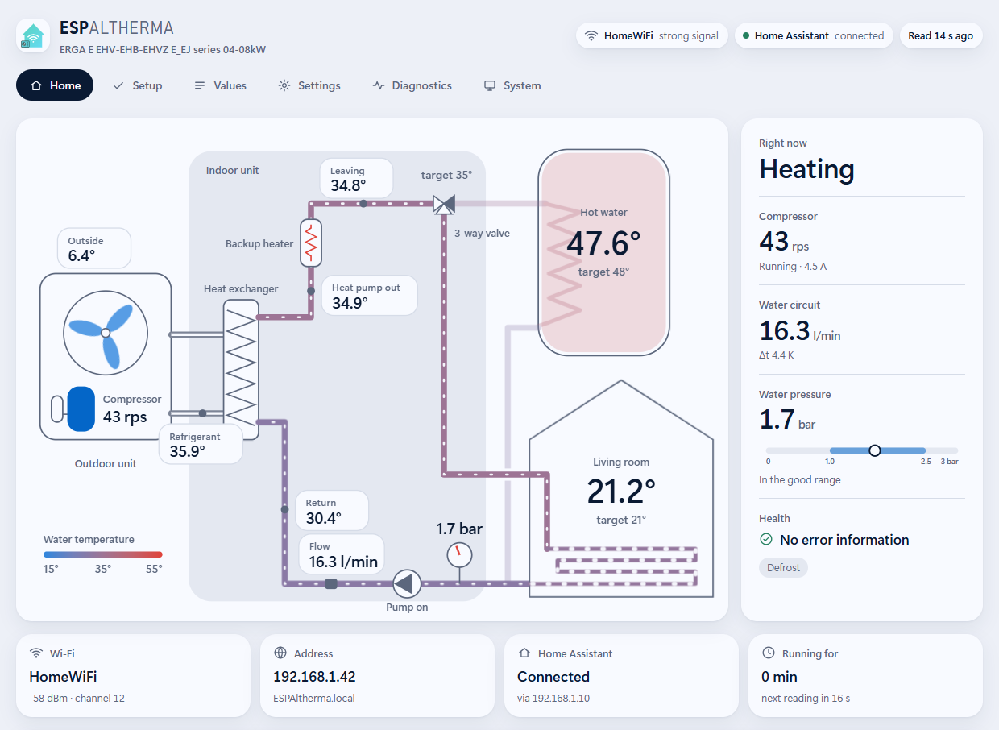

<p align="center">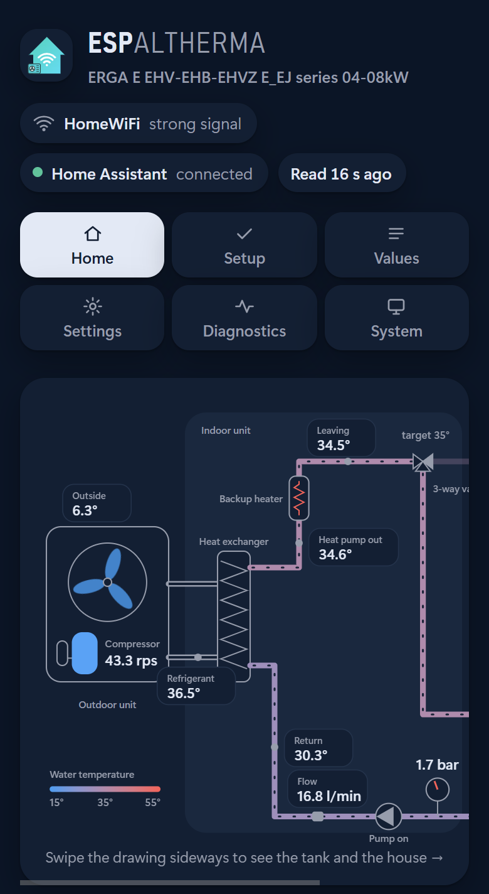</p>

And in Home Assistant:

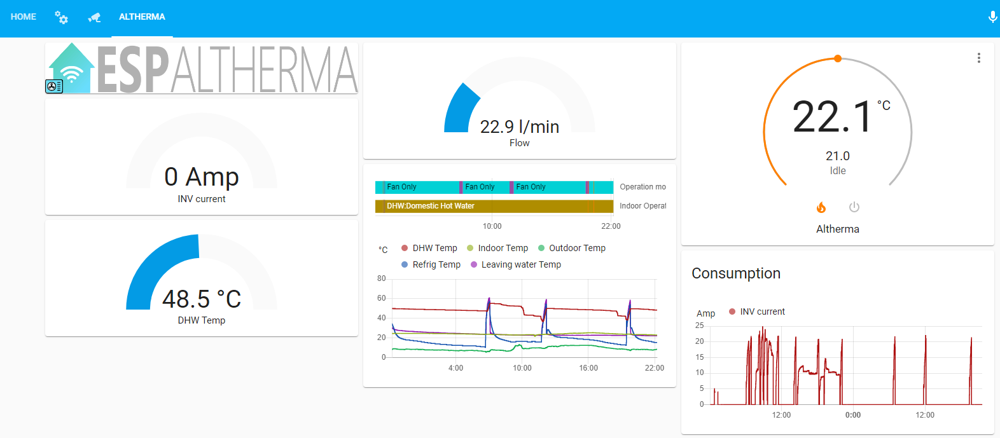

# Prerequisites

## Hardware

- A Daikin Altherma or Daikin Altherma based heat pump (ROTEX, HOVAL Belaria...)
- An ESP32. *I recommend an M5StickC (Plus, Plus2): it has an integrated display, a magnet, fits well next to the board and is properly isolated. But any ESP32 of the list below works.*
- 5 pins JST EH 2.5mm connector (or 4 Dupont wires M-F)
- A USB data cable (some cables only charge)

Supported boards: ESP32 DevKit (and most ESP32 boards), ESP32-C3, ESP32-S3, M5StickC, M5StickC Plus, M5StickC Plus2, M5Stack Tough, WT32-ETH01 and Olimex ESP32-PoE.

*The ESP8266 is not supported by ESPAltherma 2. Keep using [ESPAltherma 1.x](https://github.com/raomin/ESPAltherma/tree/main) on it.*

## Software

- Chrome or Edge on a computer

*That's all!*

# Getting started

## Step 1: Installing the firmware

1. Open the **[ESPAltherma web installer](https://raomin.github.io/ESPAltherma/flasher/)** in Chrome or Edge, on a computer.
2. Choose your board.
3. Plug the board into the computer with the USB cable and click **Install ESPAltherma**. Pick the serial port of your board in the list the browser shows, then confirm.
4. When the installation is done, the installer asks for your Wi-Fi network: enter it. It then shows the address of ESPAltherma on your network.

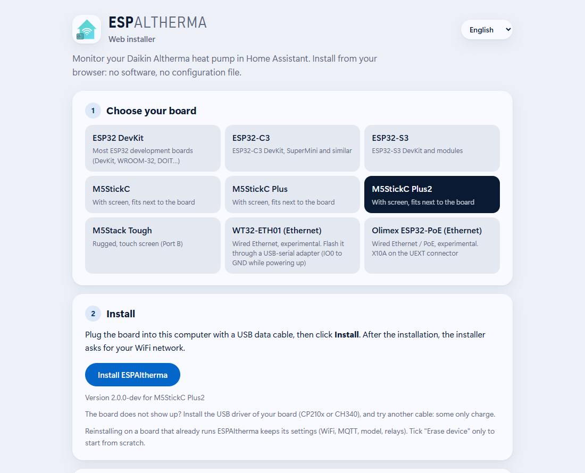

- *The board does not show up in the list?* Install the USB driver of your board (CP210x or CH340), and try another cable.
- *Reinstalling on a board that already runs ESPAltherma 2* keeps its settings (Wi-Fi, MQTT, model, relays). Tick "Erase device" only to start from scratch.
- *WT32-ETH01:* it has no USB port. Flash it through a USB-serial adapter, with IO0 connected to GND while powering it up.

## Step 2: Connecting to the heat pump

1. Turn OFF your heat pump at the circuit breaker.
2. Unscrew your panel to access the main PCB of your unit.
3. Localize the X10A connector on the PCB. This is the serial port on the main PCB. If your installation includes a bi-zone module, the X10A port is occupied with a connector to the Bi-Zone module. You should then connect to the X12A port on the bi-zone module. Pins are identical to the X10A.
4. Using the 5 pin connector or 4 Dupont wires, connect the ESP as follows. Pay attention to the orientation of the socket.

### Daikin Altherma 4 pin X10A Connection

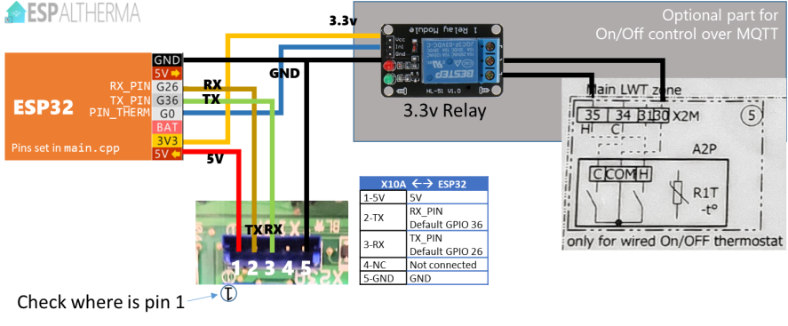

| X10A | ESP32 |
| ---- | ----- |
| 1-5V | 5V - VIN *Can supply voltage for the ESP :)* |
| 2-TX | RX pin of your board (see below) |
| 3-RX | TX pin of your board (see below) |
| 4-NC | Not connected |
| 5-GND | GND |

The RX and TX pins of each board:

| Board | RX (to X10A pin 2) | TX (to X10A pin 3) |
| ----- | ------------------ | ------------------ |
| ESP32 DevKit, ESP32-S3 | GPIO 16 | GPIO 17 |
| ESP32-C3 | GPIO 4 | GPIO 5 |
| M5StickC, M5StickC Plus, M5StickC Plus2 | G36 | G26 |
| M5Stack Tough | G36 (Port B) | G26 (Port B) |
| WT32-ETH01 | GPIO 5 (RXD) | GPIO 17 (TXD) |
| Olimex ESP32-PoE | GPIO 36 (UEXT) | GPIO 4 (UEXT) |

> The pins can be changed later in the web interface (Settings → Heat pump connection).

Once connected, it looks like this:

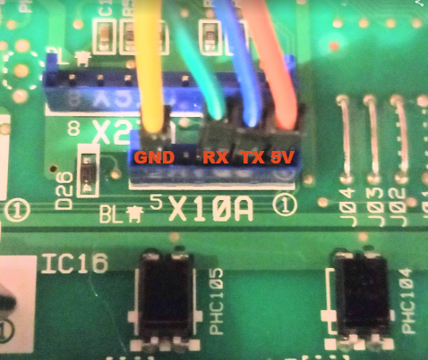

### 8 pin X10A Connection

Some heat pumps (ROTEX) have an X10A port which connects differently:

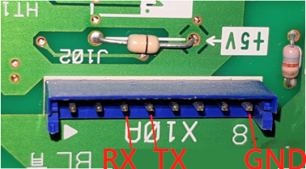

Pin 1 (on the left in the picture) is +5v. Some users reported that the 5V from their ROTEX was not strong enough to power their ESP32. In this case, use an USB charger to power the ESP32. The 5V from the X10A is then not needed.

Whatever you do, **make sure you keep a wire connecting the GND of the ESP32 to the GND pin of the X10A (even if you power your ESP32 with a USB charger)!!**

5. Cross check twice the connections and turn on your heat pump.

## Step 3: Finishing in the web interface

Open `http://espaltherma.local`, or the address shown by the installer (and on the screen of the M5). The **Setup** tab walks you through the rest.

1. **Heat pump.** ESPAltherma reads the heat pump and detects its model. Check it and click **Confirm this model**. If several models match, pick yours; if yours is not proposed, choose it from the full list ("Not this one?"). Until you confirm, only the values every candidate model reads the same way are published.

    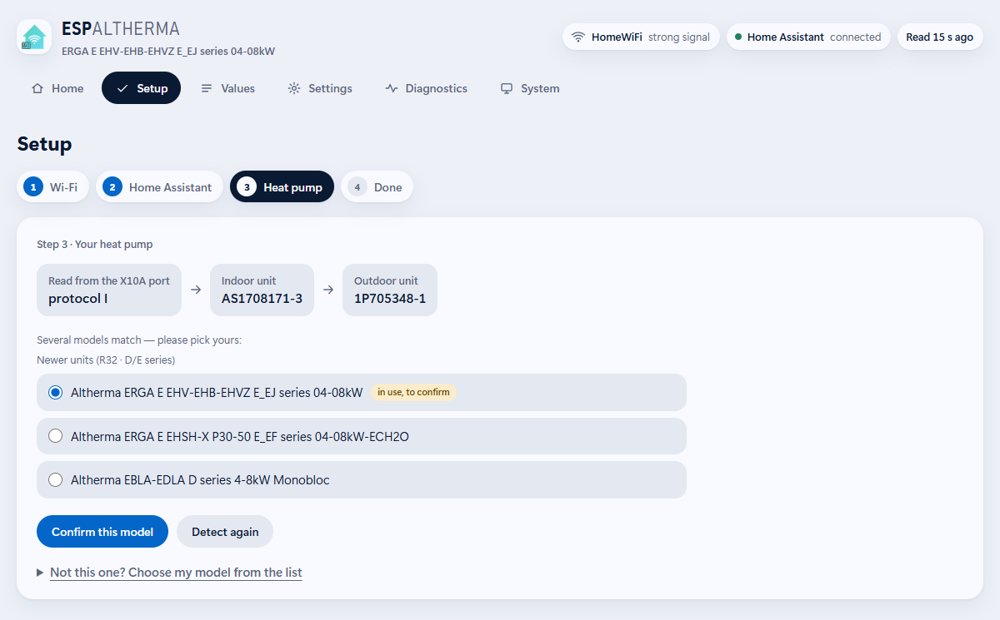

2. **Home Assistant.** Click **Find my Home Assistant**: ESPAltherma looks for the MQTT broker on your network (usually the Mosquitto add-on of Home Assistant). Or enter its address, and a user and password if your broker needs one. **Test the connection**, then save. The sensors appear in Home Assistant automatically.

    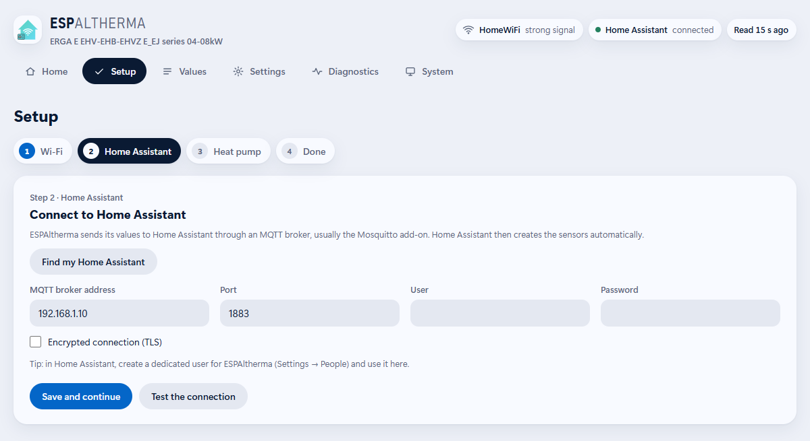

3. **Values.** The recommended values of your model are selected. Pick more (or less) in the **Values** tab, which also shows their current readings. *Try not to get everything: it would make a very big MQTT message.*

    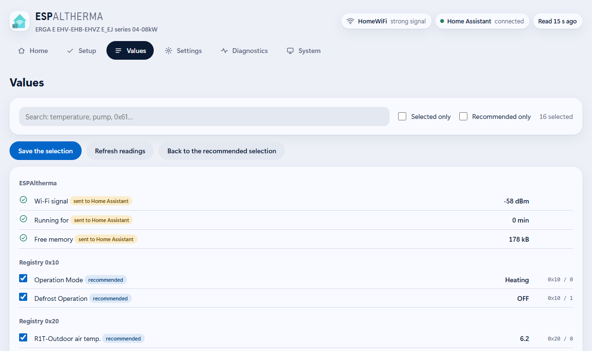

No Wi-Fi entered, or the network changed? The board opens a setup network **ESPAltherma-XXXX** (password `espaltherma`): join it with your phone and follow the page that opens.

Everything is configured at runtime and kept across updates. To protect the settings, set an admin password in Settings → This device.

## Step 4 (optional) - Controlling your Daikin Altherma heat pump

ESPAltherma cannot change the configuration values of the heat pump (see [FAQ](#faq)). However, ESPAltherma can control a relay on MQTT that can simulate an *external On Off thermostat*. Doing so allows to remotely turn on/off the heating function of your heat pump.

Connect the relay to a free GPIO of the ESP32 and set it in **Settings → Relays** (with the level that activates your relay). The switch `switch.altherma` then appears in Home Assistant; the MQTT topic is `espaltherma/POWER` (`ON` / `OFF`).

Refer to the schematic map of your heat pump to see where to connect *external On Off thermostat*.

Adding this will take priority on your thermostat. ESPAltherma will turn the heating on/off ; the thermostat will be in standby.

Note: I resoldered the J1 jumper that was cut when installing my digital thermostat (not sure if it is needed) and configured my *type of thermostat* as *External thermostat*

Once installed the setup looks like this:

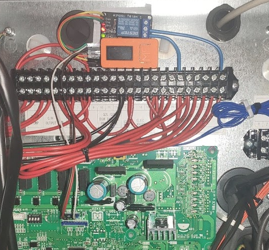

Other users installations are described [in this issue](/../../issues/17).

On a Rotex this would connect to J16 Pin 1 and 2. Note: RT needs to be switched ON in the heatpump Connection menu. Heating will be ON if pins are connected, else no heating, so connect to the NC (normally closed) of the relay.

A third relay, the *safety relay*, can stop the heat pump (for instance wired to a safety contact of your installation). Set its pin in Settings → Relays; it appears as `Altherma Safety` in Home Assistant (topic `espaltherma/SAFETY`, `1` stops the heat pump, `0` releases it).

## Step 5 (optional) - Smart grid features

ESPAltherma can also integrate with SG-Ready options of your heat pump. To do so, set the pins of the SG1 and SG2 relays in **Settings → Relays**, then send one of the allowed values (0..3) to MQTT channel `espaltherma/sg/set`, or use the `EspAltherma Smart Grid` selector in Home Assistant. Current SG mode will be available in `espaltherma/sg/state`.

Of course, you will need to use 2 more relays to open/close SG1 and SG2 contacts of your heat pump. On the M5StickC Plus, G32 and G33 of the header next to the USB C port (not the pins you used for the X10A) work well.

I found that using 5V supply pin of X10A provides enough power for my ESP32 and both relays, but your mileage may vary.

On a Rotex SG1 and SG2 contacts are located in J8 connector, pin 5-6 (Smart Grid) and 11-12 (EVU) respectively.

Once configured and connected, your heat pump will work like this:

| sg/set value| SG1   | SG2   | SG-Mode              | Working mode | Typical result |
| ----------- | ----- | ----- | -------------------- | ------------ | -------------- |
| 0           | open  | open  | 0 - normal operation | normal working mode        | HP works like if SG features are disabled/not used |
| 1           | open  | close | 1 - Forced OFF       | Hp is forced OFF           | Heating and DHW will be turned OFF - *Beware that your comfort may be negatively affected by this working mode* |
| 2           | close | open  | 2 - Recommended ON   | Hp is recommended to be ON | HP will increase DHW setpoint as well as LW setpoint (documentation says +5 °C, but my tests actually show +6 °C) |
| 3           | close | close | 3 - Force ON         | Hp is forced ON            | HP will increase DHW setpoint and will use its full power to heat DHW (to 70 °C) |

*Note that In SG3 mode your HP will really be power hungry so make sure to enable it only when electricity cost is low (ideally free) or be prepared to get a high bill!*

Depending on your HP model, SG3 might be configurable in "ECO mode", "Normal mode" or "Comfort mode". The mode can be set using the specialist code Main Menu > Settings > Input/Output.

| SG-Mode | Description |
| ------- | ----------- |
| Comfort mode | Increase of the hot water set temperature by 5 K. |
| Normal mode | Increase of flow set temperature by 2 K and hot water set temperature by 5 K. |
| ECO mode | Increase the flow set temperature by 5 K and hot water set temperature by 7 K. |

Note: Smart Grid needs to be switched ON in the heatpump configuration menu, otherwise SG1 and SG2 contacts are not evaluated.

# Updating

- **From the web interface:** in **System → Firmware update**, upload the `-ota.bin` file of your board from the [latest release](https://github.com/raomin/ESPAltherma/releases) (for example `m5stickcplus2-ota.bin`). If the new version cannot get back online, the board goes back to the previous one by itself.
- **Or run the [web installer](https://raomin.github.io/ESPAltherma/flasher/) again** over USB. It keeps the settings.

# Building it yourself

The web installer is the easiest way, but you can build and upload the same firmware with [PlatformIO](https://platformio.org/):

```bash
git clone -b feature/web-flasher-autodetect https://github.com/raomin/ESPAltherma.git
cd ESPAltherma
pio run -e web-m5stickcplus2 -t upload
```

Use the environment of your board:

| Board | Environment |
| ----- | ----------- |
| ESP32 DevKit | `web-esp32` |
| ESP32-C3 | `web-esp32c3` |
| ESP32-S3 | `web-esp32s3` |
| M5StickC / M5StickC Plus / M5StickC Plus2 | `web-m5stickc` / `web-m5stickcplus` / `web-m5stickcplus2` |
| M5Stack Tough | `web-m5stack-tough` |
| WT32-ETH01 / Olimex ESP32-PoE | `web-wt32-eth01` / `web-esp32-poe` |

There is nothing to edit before building: the board starts its setup network (see [Step 3](#step-3-finishing-in-the-web-interface)) and everything is configured in the web interface. In VS Code, select the environment in the PlatformIO status bar and click Upload.

To update a board that is already installed, upload `.pio/build/<environment>/firmware.bin` in System → Firmware update, or upload over the network with `pio run -e <environment> -t upload --upload-port espaltherma.local` (with an admin password set, add `upload_flags = --auth=<your admin password>` to the environment in `platformio.ini`).

# Coming from ESPAltherma 1.x

- Install ESPAltherma 2 with the web installer, over USB. Your `setup.h` is not read anymore: enter the Wi-Fi when the installer asks, then the MQTT broker, the pins (if you did not use the default ones) and the relays in the web interface.
- ESPAltherma 2 selects the recommended values of your model. Add the other values you had in your definition file in the Values tab.
- **If you used an English definition file**, Home Assistant keeps the same device and the same entity IDs (`sensor.espaltherma_...`), so your history, dashboards and automations keep working for the values you select again.
- **If you used a translated definition file** (`def/French/`, `def/German/`...), your entity IDs and the attribute names of `sensor.althermasensors` came from the translated labels. ESPAltherma 2 always builds them from the English labels: only the displayed names follow the language (Settings → This device). So:
    - Home Assistant creates new entities, e.g. `sensor.espaltherma_leaving_water_temp_before_buh_r1t` instead of `sensor.espaltherma_auslass_phe_r1t`. Update your dashboards and automations.
    - To get rid of the old entities, [clear the discovery](#device-discovery) once, then restart ESPAltherma: it publishes only the new ones. To keep the history of a sensor, you can then give the new entity the old entity ID (entity settings in Home Assistant).
    - Templates reading `state_attr('sensor.althermasensors', ...)` need the English attribute names, which the Values tab shows when the language is English.
- To go back, build and upload ESPAltherma 1.x from the [main branch](https://github.com/raomin/ESPAltherma/tree/main) as before.

# How it works

All the definition files of [definitions](definitions) (34 models) are merged at build time into one catalog of 646 distinct values (`scripts/gen_catalog.py`). One firmware therefore knows every model: it only has to find out which one it is connected to, and check that the definition really matches the unit.

## Detecting the heat pump

1. **Protocol.** ESPAltherma asks registry `0x60` in protocol I. If nothing answers, it tries registry `0x53` in protocol S (older units).
2. **Survey.** It reads once every registry the definition files use (on protocol I, `0x61`, `0x62`... are walked until the first missing one, like D-Checker does). The result is the detection report, published on `espaltherma/detect` and shown in Diagnostics → Heat pump survey.
3. **Identification.** Registry `0x63` holds the AS number of the indoor board, as printed on its label: `AS1708171-30 F` reads `01 70 81 71 03 06`. ESPAltherma looks it up in a table of 731 known AS numbers and the models they are fitted in ([data/as_numbers.json](data/as_numbers.json)), which gives the candidate definitions. The AS number, the software ID (`0x60`), the outdoor capacity (`0x00`, offset 12, in kW x10) and the outdoor board part number (`0x11`) together form an identification key.
4. **Known units.** A key listed in [data/fingerprints.json](data/fingerprints.json) names the model directly. The table grows from the reports users share.
5. **Scoring.** The candidates (every model when the AS number is unknown) are scored against the survey:
    - the registries the model reads must answer, and the family-specific ones it does not know (`0xA0`, `0xA1`, `0x65`) should not;
    - replies must be at least as long as what the model reads, ideally exactly as long;
    - the values at the model's temperature, voltage, current and flow slots must be physically plausible;
    - the outdoor capacity must be in the range of the definition.
6. **Confidence.** Models that read the recommended values the same way count as one. On protocol I, the confidence is **high** only with a known key or a single AS number candidate: the model is then used right away. (Protocol S has two definitions, told apart by the registries that answer.) Otherwise (the DA and DJ series, for instance, share their AS numbers) you confirm the model in Setup → Heat pump. Until then, ESPAltherma only publishes the *safe values*: the recommended values that every close candidate reads identically (same registry, offset, conversion and size).

The survey runs at every start. If another heat pump answers (the key changed), the model is detected again. While no model is known, the survey is retried every minute, in case the cable was plugged in after the board.

## Correcting wrong definitions

Some definitions do not match every unit of their series. In several registries (`0x00`, `0x21`, `0x30`, `0x61`...) the definitions place 2-byte values at different offsets. With the wrong layout, each value is read across two neighbours: absurd numbers that jump by 25.6 each time the neighbouring byte changes by one. On a real EPGA16, registry `0x21` matches the Gen-1 layout, not its own definition.

For those registries, ESPAltherma scores every candidate layout, taken from the other definitions, on each poll:

- **plausible:** the values are in a physical range;
- **steady:** they change little between two polls;
- **mirrored:** they equal a sensor of another registry (the heat pump often serves the same sensor twice).

A registry switches to another layout only on clear evidence:

- after at least 4 polls, the definition's own layout reads fewer than 90% plausible values;
- the other layout is always plausible, never jumps and reads real (non-zero) values;
- this is backed by jumps of the current layout or by mirrored values.

Registries without evidence, for instance all zero while the unit is idle, are never touched.

The corrected registry is then read with the layout (and the labels) of that other definition. Corrections are logged and listed in Diagnostics → Definition corrections, where you can undo them or turn off *Correct automatically*. They are cleared when the model changes.

Posting your detection report and your exact model in an issue helps: it adds your unit to the known keys, and a correction found on your unit shows which definition needs fixing.

# Troubleshooting

## Where to look first

The **Diagnostics** tab of the web interface shows the event history (restarts and their cause, network drops, dated), the heat pump survey and the log. The log is also published on the MQTT topic `espaltherma/log`, and printed on the USB serial port (115200 bauds). You can see the MQTT messages in Home Assistant through Settings → Devices & services → MQTT → Configure → Listen to a topic `espaltherma/#`, or with:

```bash
$ mosquitto_sub -v -t "espaltherma/#"
```

## No heat pump answered, 'Time out! Check connection', 'Wrong CRC on registry...'

This means that the communication is wrong. Usual suspects:

1. Un-connected GND: whatever you do, the GND of the ESP should always be connected to the GND of the Altherma. So, if you power your ESP with a USB charger (or your computer), make sure you also connect the GND from the ESP to your GND of the Altherma.
2. If not GND, then it's always the Dupont cable. A faulty dupont cable is a VERY COMMON cause of issue. You can have a perfectly looking cable, they are not the best to do connection on the X10A connector (although much more common than an EH JST 5pin). So, change your cable. You can also use a common 2.54 female long header, plug it to the X10A connector and then your dupont cable to the long pins of the header.
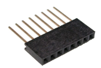
3. RX and TX swapped, or other pins than the ones set in Settings → Heat pump connection.

Once fixed, click **Detect again** in Setup → Heat pump.

## Older heat pumps (S protocol)

Older Altherma heat pumps (around 2010 or before) use the older S protocol. ESPAltherma detects it by itself. If it does not, choose the `PROTOCOL_S` (or `PROTOCOL_S_ROTEX`) model from the full list in Setup → Heat pump.

## The board restarts or drops off the network

Open Diagnostics → Event history: it tells why the board restarted (power, crash, watchdog, Wi-Fi lost for too long...). A weak 5V from the X10A is a common cause: on M5 boards, the supply voltage is shown in the Values tab. Power the board from a USB charger in that case (and keep the GND wire).

## Note on voltage

The serial port of X10A is TTL 5V, where the ESP32 is 3.3V. Your ESP32 might not be 5V tolerant. If you want to play it safe, you should use a level shifter to convert Daikin TX - RX ESP line from 5V to 3.3V.

In practice, I had no problem connecting an ESP32 without level shifters. I also had no issue powering the ESP32 from the 5V line of the X10A. On my Daikin Altherma, 5V is provided by a 7805 with a massive heat sink, plus, there are not many clients for it on the board and the ESPAltherma running on my ESP32 consumes 70ma.

Some users reported that a ROTEX did not have a stable 5v that could be used to power the ESP32. If so, you would need to rely on an external 5V power supply (eg a regular USB charger) to power the ESP32.

# Integrating with Home Assistant

ESPAltherma integrates easily with Home Assistant using [MQTT Discovery](https://www.home-assistant.io/integrations/mqtt/#mqtt-discovery).

On successful startup, ESPAltherma will generate one distinct device "Daikin Altherma via ESPAltherma" and two entities under the device "ESPAltherma" under the MQTT integration in Home Assistant:

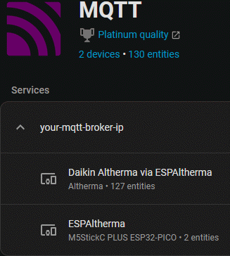

The "Daikin Altherma via ESPAltherma" device will contain all the values you selected, while the "ESPAltherma" device will contain two more low-level entities:

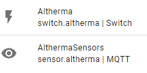

- `sensor.althermasensors` holds the sensor values as attributes.
- `switch.altherma` activates the thermostat relay (Step 4), when one is set.

## Device Discovery

ESPAltherma will generate a device discovery JSON and publish that to MQTT topic `homeassistant/device/espaltherma-mqtt-discovery/config` for Home Assistant to pick up. The software will attempt to make the devices as specific to their unit as possible. Other characteristics:

- Their name will be the label name, in the language chosen in Settings → This device, e.g. "Discharge pipe temp.(R2T)"
- Their entity ID will be `sensor.espaltherma_` followed by a lowercase, alphanumeric only conversion of their English labels with spaces replaced by underscores. For example: "Discharge pipe temp.(R2T)" becomes `discharge_pipe_tempr2t`. The IDs stay the same whatever the language.

To clear the configuration, for example after adding or removing some sensor, publish an empty, retained message to `homeassistant/device/espaltherma-mqtt-discovery/config`.

## Declaring sensor entities

The discovery shown above will create all sensor entities for you, but it's still possible to create your own sensors as before, for example when you need custom conversions or calculations.

In Home Assistant, all values reported by ESPAltherma are `attribute`s of the `entity` sensor.althermasensors.

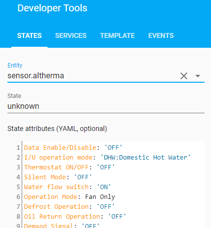

If you want to integrate specific `attribute`s in graphs, gauge etc. you need to declare them as `sensor`s using `template` in your `configuration.yaml`. See [HA doc on Template](https://www.home-assistant.io/integrations/template/).

Eg. this template declares the 2 operation modes as entities, the DHW tank temperature and the current of the primary inverter:

```yaml
template:
  - unique_id: "espaltherma"  # will be prefixed to all unique IDs
    sensor:
    - name: "Operation mode"
      unique_id: "operation"
      state: "{{ state_attr('sensor.althermasensors','Operation Mode') }}"
    - name: "Indoor Operation mode"
      unique_id: "iuoperation"
      state: "{{ state_attr('sensor.althermasensors','I/U operation mode') }}"
    - name: "DHW Temp"
      unique_id: "dhw"
      state: "{{ state_attr('sensor.althermasensors','DHW tank temp. (R5T)') }}"
      unit_of_measurement: '°C'
    - name: "Inverter primary current"
      unique_id: "inv_primary_current"
      state: "{{ state_attr('sensor.althermasensors','INV primary current (A)') }}"
      unit_of_measurement: 'A'
      device_class: current
```

After restarting Home Assistant, these entities can be added to an history card:

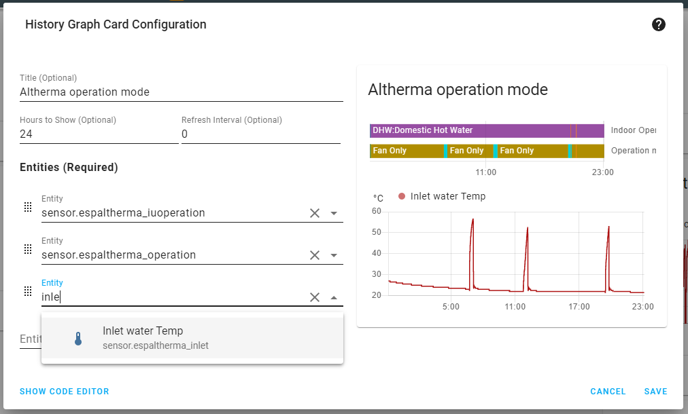

## A Climate entity

To control heating through the On/Off switch, declare a Climate (aka thermostat) entity monitoring a temperature sensor.

```yaml
climate:
  - platform: generic_thermostat
    name: Altherma
    heater: switch.altherma
    target_sensor: sensor.temproom1
    min_temp: 15
    max_temp: 25
    cold_tolerance: 0.5
    hot_tolerance: 0.5
    min_cycle_duration:
      minutes: 30
    away_temp: 15
    precision: 0.1
```

Then, add a Thermostat card somewhere:

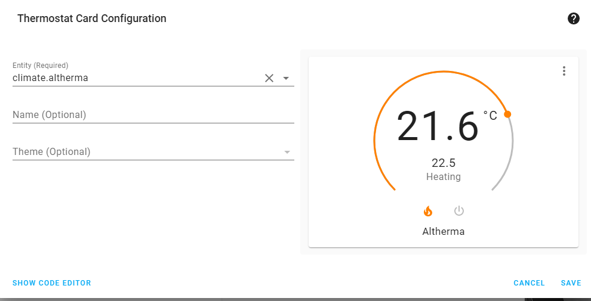

## Calculating COP

The information returned by ESPAltherma allows to calculate the coefficient of performance (COP). It is the ratio of the heat delivered by your heat pump to the energy consumed by it.

When put in terms of ESPAltherma variables, the COP can be define as a sensor like this in the `sensor:` section of Home Assistant:

```yaml
    - name: "COP"
      unique_id: "espaltherma_cop"
      unit_of_measurement: 'COP'
      state: "
{{
  ((state_attr('sensor.althermasensors','Flow sensor (l/min)')| float * 0.06 * 1.16 * (state_attr('sensor.althermasensors','Leaving water temp. before BUH (R1T)') | float - state_attr('sensor.althermasensors','Inlet water temp.(R4T)')|float) )
    /
  (state_attr('sensor.althermasensors','INV primary current (A)') | float * state_attr('sensor.althermasensors','Voltage (N-phase) (V)')|float / 1000))
  |round(2)
}}
 0 "
```

## MQTT topics

| Topic | |
| ----- | - |
| `espaltherma/ATTR` | All the values, as a JSON message |
| `espaltherma/LWT` | `Online` / `Offline` |
| `espaltherma/log` | Log messages |
| `espaltherma/detect` | The detection report: identification codes of your heat pump, every registry read once, detected model. Send anything to `espaltherma/detect/run` to read it again |
| `espaltherma/POWER`, `espaltherma/STATE` | Thermostat relay: `ON` / `OFF` |
| `espaltherma/sg/set`, `espaltherma/sg/state` | Smart Grid mode, `0` to `3` |
| `espaltherma/SAFETY`, `espaltherma/SAFETY_STATE` | Safety relay: `1` stops the heat pump, `0` releases it |

# FAQ

## Great! I can now monitor my heat pump! Can I change the configuration values too?

Not directly. It might be possible to change registry values using the serial port but I'm not aware of this. If you know, comment on [the dedicated issue](https://github.com/raomin/ESPAltherma/issues/1).

However, ESPAltherma, supports an extra GPIO to control a relay that you can plug as *external On/Off thermostat*. See [**Controlling your Daikin Altherma heat pump**](#step-4-optional---controlling-your-daikin-altherma-heat-pump).

If you want to configure your heat pump using an arduino, you can interact with the P1P2 serial protocol (the one of the digital thermostats) using the [nice work on P1P2Serial](https://github.com/Arnold-n/P1P2Serial) of Arnold Niessen.

## Where can I get more info on the protocol used?

It took quite some time to reverse engineer the protocol. If you're interested, I documented my findings [here](doc/Daikin%20I%20protocol.md).

## Is it safe? Can I break my machine?

It is as safe as interacting with a serial port can be. Pretty safe if you are a bit careful. Use is entirely at your own risk. No liability.

## Why not using the Daikin LAN adapter?

Of course you can probably achieve the same with the BRP069A62 adapter. However, it is expensive, not wifi and less fun than doing it yourself :)

## I selected a value but it is always returning 0 (or OFF)

The definitions contain values for a range of products. It is possible that some of the values are not implemented in your specific heat pump. The Values tab shows the current reading of each value: use it to see which ones your unit really reports.

If it says 'conv XXX not avail.' it is that I did not implement this specific conversion of value. If you need this value, create an issue and I'll implement it.

## What is the meaning of this value?

Some times the names of the values can be cryptic. Sometimes, the names are more informative on other models: You can look for the registry in other model this can give you a hint. Eg.: One one file `0x62,15` is `"Pressure sensor"` => on the other `0x62,15` is `"Refrigerant pressure sensor"`.

I'm not an expert in heat pump, so I don't understand all possible values. Collectively however, I'm sure that we can understand a lot.

I created [a page in the WIKI](https://github.com/raomin/ESPAltherma/wiki/Information-about-Values). You can add your comments on the register values and suggest possible better names!

## My Daikin heat pump is not an Daikin Altherma. Can I still control it?

No, ESPAltherma supports only Altherma protocol. Other (AC only) units also have a serial port but using other protocols that would require extra reverse engineering to be implemented.

## How can I update ESPAltherma remotely?

From the web interface, without unplugging it from the heat pump: see [Updating](#updating).

## I'm using OpenHAB (or others) can I get the values in separated MQTT topics?

Yes. In Settings → MQTT output, tick **One topic per value**. Each value is then also published in `espaltherma/OneATTR/[valuename]` eg `espaltherma/OneATTR/Boiler Heating Target Temp.` (the prefix can be changed there).

## How can I contribute?

Every contribution to this project is highly appreciated! Don't fear to create issues to report possible bugs or feature request. Pull requests which enhance or fix ESPAltherma are also greatly appreciated for everybody!

The values of each heat pump model are described in the definition files of the [definitions](definitions) folder. The firmware's catalog of models is generated from them when building (`scripts/gen_catalog.py`).

If this project is useful to you, and if you want, <b>[you can buy me a beer](https://www.buymeacoffee.com/raomin)</b>! It feels good and really helps improving ESPAltherma. Thanks :)

You can also [sponsor this project](https://github.com/sponsors/raomin/) (ie regular beers :)) and become an official supporter of ESPAltherma and get your badge on this page!

## ❤ Regular Sponsors ❤

<a href="https://github.com/gerione">@gerione</a><br/>
<a href="https://github.com/kloni">@retrack (Antoine Coetsier)</a><br/>
<a href="https://github.com/EvertJob">@EvertJob (toppe)</a><br/>
<a href="https://github.com/FusisCaesar">@FusisCaesar</a><br/>
<a href="https://github.com/Mychel60">Michael</a><br/>

# License
ESPAltherma is licensed under 
