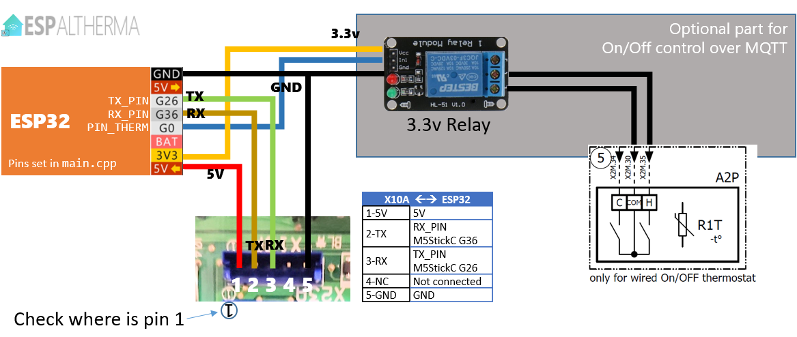

# Getting started

## Step 1: Uploading the firmware from source code

1. Download the repository folder and open it in PlatformIO. When opening the project all required components and plugins will be downloaded and installed by PlatformIO.

2. Optional - If you are using an **M5StickC** (or M5Stack), select the corresponding environment from the status bar:
Click   and select **env:M5StickC** on the top. The status bar should display 
For **M5StickCPlus** select **env:M5StickCPlus**
If you are using an **ESP8266** select the `nodemcuv2` environement.

3. You're ready to go! Connect your ESP32/ESP8266 and click -> Upload! Or press `F1` and select -> `PlatformIO: Upload`

## <a id="section-generate-definition-files"></a>Step 2: Build X10A and CAN definition files

The parameter and command definitions are stored in a template format. To generate a fully useable .json file for upload and use on the X10A or CAN bus, please execute the following commands in the "PlatformIO Core CLI". Press `F1` and select -> `PlatformIO: Open PlatformIO Core CLI` to open the terminal, then enter the commands below:

```bash
python scripts\build_x10a_commands.py
python scripts\build_can_commands.py
```

You will receive output indicating which files are generated. These generated files can be found in the `build` folder, along with a subfolder named either `CAN` or `X10A`. These files are ready for upload and use.

## Step 3: Configure/Setup your ESPAltherma

By default, ESPAltherma will generate an open WiFi network named `ESPAltherma-Config-WiFi`. Connect to the WiFi network, open your browser, and enter the following URL to access the configuration page: `http://192.168.1.1/`.


Take the changes you need an click on `SAVE CONFIG` on the bottom. If all fields are field with valid input, the config will be sendet to ESPAltherma. This will restart ESPAltherma with the new config. If some fields are not contain valid informations, the saving will be canceld and the bad field marked with a red flag. To get a better description and overview of the options, here is a brief list and description of them:

<details>
<summary><a id="config-section-network"></a>Network</h3></summary>


Here you can choose if ESPAltherma should generate an own WiFi signal or connect to a router.

When `Use standalone WiFi` is disabled, near Wifi in range can be scanned by clicking on the blue arrow button to the right. The process will be done in background from ESPAltherma and reported back when finished. During this process, the generated WiFi signal from ESPAltherma will be disabled and enabled again when the process is finished. Please make sure to connect again to the signal, if not done automaticaly, to recieve the scan results and get them dispaly in the dropdown field.

By default, ESPAltherma will use DHCP. You can assign a fixed IP and DNS Server by checking the option `WIFI use static IP`
</details>

<details>
<summary><a id="config-section-mqtt"></a>MQTT</summary>


ESPAltherma needs a MQTT-Broker to commmunicate with external devices and services - its one of its core functions. Please enter the Server, Username and Passwort information. If you enter `localhost` or `127.0.0.1` as server name, this will generated an internal loopback service and no communication over MQTT will be done. This options are more for testing and debug then to use in productiv enviroment.

You can also enter the topic name ESPAltherma will use. All transmitions from ESPAltherma will use this topic name as the root element and subscription will be also done this way for setting values like Ports, Relays, Bus-Calls, ...

The Frequency defines how often MQTT messages with current values will be transmitted over the MQTT-Broker
</details>

<details>
<summary><a id="config-section-pins"></a>Pins</summary>


ESPAltherma supports multiple services that can be connected to it over the GPIO's. Those services are:
- [ESPAltherma reset pin](#espaltherma-reset-pin)
- [X10A-Bus](#config-section-x10a)
- [Heating and cooling control over pins](#heating-and-cooling-control)
- [SmartGrid control over pins](#smartgrid-control)
- [CAN-Bus](#config-section-can)

#### ESPAltherma reset pin

When the selected pin gets connected to ground, the current configuration will be changed. ESPAltherma will be restarted with Standalone WiFi enabled. This change will be permanent until config is updated again.

####  Heating and Cooling control

When enabled, the selected pin for heating and cooling will be setted to HIGH or LOW over MQTT. To set the pin a MQTT publish needs to be done on the configured MQTT root topic and `SET/HEATING` or `SET/COOLING` with payload `ON` or `OFF`.

As example: `espaltherma/SET/HEATING` with payload `ON` will enable heating pin.

More information will you find [here](#section-controling-heatpump)

####  SmartGrid control

The selected pins can be setted to HIGH or LOW over MQTT. To set the pin a MQTT publish neds to be done on the configured MQTT root topic and `SET/SG` with payload `0` to `3`.

As example: `espaltherma/SET/SG` with payload `3` will enable SmartGrid Mode `Force ON`.

More information will you find [here](#section-controling-smartgrid)
</details>

<details>
<summary><a id="config-section-x10a"></a>X10A</summary>


On the pins section, select your RX TX GPIO pins connected to the X10A port. *The ESP32 has 3 serial ports. The first one, Serial0 is reserved for ESP<-USB->PC communication and ESP Altherma uses the Serial0 for logging (as any other project would do). So if you open the serial monitor on your PC, you'll see some debug from ESPAltherma. ESP32 can map any GPIO to the serial ports. Do NOT use the main Serial0 GPIOs RX0/TX0.* * The ESP8266 only has 1.5 Serial ports so it uses a software based serial driver. You can choose any pins, but some will stop you from being able to use the console*

For ESP32 try to stick to the RX2/TX2 of your board (probably GPIO16/GPIO17). **For M5StickC or M5StickCPlus, 26 and 36 will automatically be used if you selected the corresponding environment**. For ESP8266 pins 4 & 5 (D2 & D1 on the NodeMCUv2) are known to work well.

To start the communication you need to upload a parameters file and select commands from it or define custom commands to be used, that will be readed and transfered over MQTT.

By default the `Protocol I` is selected to be used. Some older heat pumps use a different protocol (`Protocol S`). A closer description, witch protocol needs to be used, may be found inside the parametes file of the model.

1. Under `Upload Parameters file` select the parameters file to upload and click the `Upload` button. The files needs to be generated (see [here](#section-generate-definition-files)). Select a file under the folder `build/X10A/` for upload. Each known model has an own parameters file in .json format. The default language available is `English` but other translation exists too. If a translation for you language exists, you will find it in the corresponding folder.
<br/><br/>
*If you're not sure which one to take, choose the closest or Default.h. The only thing that could happen is that you would have missing values, null values or wrong label names.*

2. After upload the dropdown-list next to the Upload section will be filled with new options. Select the `Model`, `Language` and a `Preset`. The Preset `All` will list available parameters in the selected file. Other presets will filter the List based on definition inside the uploaded file. Once a Preset is selected, a list of availbable commands will pop up to the side (`Parameters` List). Select the parameters needed to be scanned and transmitted by click on them with the left mouse and confirm the selection by clicking the button `Add to selected parameters`. The choosen parameters will be shown now on the right side (`Selected Parameters` List).
<br/>
A wiki page is available [here](https://github.com/raomin/ESPAltherma/wiki/Information-about-Values) where everyone can comment on the values and their definition.

3. Optional - To test the parametes or see there values, you can start fetch them once and see a live result. This allows to test the parameters file and the parameters defined in in. Todo so, click the button `Load model values` on one of the lists.

4. Optional - You can add custom parameters to if a parameter is missing in a certain parametes file. You can also combine files by select one, add the needs parameters, switch to the next parameters file and add the parameters either.

5. You're ready to go! Connect your ESP32/ESP8266 and you should see MQTT messages
</details>

<details>
<summary><a id="config-section-can"></a>CAN-Bus</summary>


ESPAltherma supports control over the CAN-Bus of the heatpump. Reading values and sending of commands are supported. To support a CAN-Bus (TWAI) protocol a external controller or transciever needs to be used. Either needs the controller or transciever support the selected kbps for the CAN-Bus. Supported chips are at the moment build in `SJA1000`(*please be aware of the different capatilities of your ESP32-Board and the revision*), `MCP2515` and `ELM327`.

Please select the corrosponding chip and pins under the `Pins` config section.


Once CAN-Bus is enabled under the `Pins` config section, the section `CAN-Bus` will be available. You can choose the CAN-Bus speed of your heat pump (by default 20 kbps) and enter a MQTT topic name where the values will be published (MQTT root topic name plus the entered CAN topic name).

The poll mode allows to select, if and how values will be fetched from CAN-Bus. If you want to get each X seconds the selected commands values, enable it by select `Auto` and enter a `Poll time in seconds`.


1. Under `Upload CAN-Bus definition file` select the commands file to upload and click the `Upload` button. The files needs to be generated (see [here](#section-generate-definition-files)). Select a file under the folder `build/CAN/` for upload. Each known model has an own commands file in .json format. The default language available is `English` but other translation exists too. If a translation for you language exists, you will find it in the corresponding folder.

2. After upload the dropdown-list next to the Upload section will be filled with new options. Select a `Model` and `Language` from the dropdown. Once selected, a list of available commands will pop up to the side (`Available Commands:` List). Select the commands needed to be scanned and transmitted by click on them with the left mouse and confirm the selection by clicking the button `Add to selected commands`. The choosen commands will be shown now on the right side (`Selected Commands` List).

3. Optional - To test the parametes or see there values, you can start fetch them once and see a live result. This allows to test the commands file and the commands defined in in. Todo so, click the button `Load model values` on one of the lists.

4. Optional - to send commands over CAN, you need to publish it over MQTT. Generate your message with MQTT root topic name plus `SET/` plus the entered CAN topic name plus the `Name` of the command. The payload will be transfered over CAN and converted to the correct bytes based on the datatyp of the given command.

Example to enable `Quiet Mode`: `espaltherma/SET/CAN/quiet_mode` with payload `1`

5. Optional - You can add custom commands to if a parameter is missing in a certain parametes file. You can also combine files by select one, add the needs commands, switch to the next commands file and add the commands either.

6. You're ready to go! Connect your ESP32/ESP8266 and you should see CAN messages
</details>

<details>
<summary><a id="config-section-export-import"></a>Export/Import</summary>


Here you can save your current config and import an already stored config file. All configuration, including commands, will be exported and restored.
</details>

<details>
<summary><a id="config-section-update"></a>Update</summary>


If a new Firmware is released, the compiled binary can be flashed by select it click `Start update` button
</details>

<details>
<summary><a id="config-section-web-serial"></a>Web Serial</summary>


This view shows debug and test informations. It allows to set the status of ESPAltherma. Also will you get the `CAN-Sniffing` results if enabled.
</details>

## <a id="section-connect-heatpump"></a>Step 4: Connecting to the Heat pump

1. Turn OFF your heat pump at the circuit breaker.
2. Unscrew your pannel to access the main PCB of your unit.
3. Localize the X10A connector on your the PCB. This is the serial port on the main PCB. If your installation include a bi-zone module, the X10A port is occupied with a connector to the Bi-Zone module. You should then connect to the X12A port on the bi-zone module. Pins are identical to the X10A.
4. Using the 5 pin connector or 4 Dupont wires, connect the ESP as follow. Pay attention to the orientation of the socket.

### Daikin Altherma 4 pin X10A Connection



| X10A | ESP32 |
| ---- | ----- |
| 1-5V | 5V - VIN *Can supply voltage for the ESP :)* |
| 2-TX | `RX_PIN` *Default GPIO 16. Prefer RX2 of your board.* |
| 3-RX | `TX_PIN` *Default GPIO 17. Prefer TX2 of your board.* |
| 4-NC | Not connected |
| 5-GND | GND |

> ESP `RX_PIN` `TX_PIN` can be changed in `src/setup.h`.

### 8 pin X10A Connection

Some heat pumps (ROTEX) have an X10A port which connects differently:


Some users reported that the 5V from their ROTEX was not enough to power their ESP32/ESP8266. In this case, use an USB charger to power the ESP32/ESP8266. The 5V from the X10A is then not needed. Whatever you do, **make sure you keep a wire connecting the GND of the ESP32/ESP8266 to the GND pin of the X10A (even if you power your ESP32/ESP8266 with a USB charger)!!**


5. Cross check twice the connections and turn on your heat pump. Two new entities AlthermaSensor and AlthermaSwitch should appear in Home Assistant. AlthermaSensor holds the values as attributes.

You can also monitor values and debug messages on your MQTT server:

```bash
$ mosquitto_sub -v -t "espaltherma/#"
```

or via Home Assistant Configuration->Integration->MQTT Configure->Listen to topic espaltherma/# -> Start Listening

## <a id="section-controling-heatpump"></a>Step 5 (optional) - Controling your Daikin Altherma heat pump

ESPAltherma cannot change the configuration values of the heat pump (see [FAQ](#faq)). However, ESPAltherma can control a relay on MQTT that can simulate an *external On Off thermostat*. Doing so allows to remotely turn on/off the heating function of your heat pump. A second relay can be used to trigger the cooling function.

Refer to the schematic map of your heat pump to see where to connect *external On Off thermostat*.

Adding this will take priority on your thermostat. ESPAltherma will turn the heating on/off ; the thermostat will be in standby.

Note: I resoldered the J1 jumper that was cut when installing my digital thermostat (not sure if it is needed) and configured my *type of thermostat* as *External thermostat*

Once installed the setup looks like this:


Other users installations are described [in this issue](/../../issues/17).

On a Rotex this would connect to J16 Pin 1 and 2. Note: RT needs to be switched ON in the heatpump Connection menu. Heating will be ON if pins are connected, else no heating, so connect to the NC (normally closed) of the relay.

## <a id="section-controling-smartgrid"></a>Step 6 (optional) - Smart grid features
ESPaltherma can also integrate with SG-Ready options of your heat pump. To do so, uncomment and configure `PIN_SG1` and `PIN_SG2` in `src/setup.c` and send one of the allowed values (0..3) to MQTT channel `espaltherma/sg/set`. Current SG mode will be available in `espaltherma/sg/state`.

Of course, you will need to use 2 more relays to open/close SG1 and SG2 contacts of your heat pump.

I found that using 5V supply pin of X10A provides enough power for my ESP32 and both relays, but your mileage may vary.

On a Rotex SG1 and SG2 contacts are located in J8 connector, pin 5-6 (Smart Grid) and 11-12 (EVU) respectively.

Once configured and connected, your heat pump will work like this:

| sg/set value| SG1   | SG2   | SG-Mode              | Working mode | Typical result |
| ----------- | ----- | ----- | -------------------- | ------------ | -------------- |
| 0           | open  | open  | 0 - normal operation | normal working mode        | HP works like if SG features are disabled/not used |
| 1           | open  | close | 1 - Forced OFF       | Hp is forced OFF           | Heating and DHW will be turned OFF - *Beware that your comfort may be negatively affected by this working mode* |
| 2           | close | open  | 2 - Recommended ON   | Hp is recommended to be ON | HP will increase DHW setpoint as well as LW setpoint (documentation says +5 °C, but my tests actually show +6 °C) |
| 3           | close | close | 3 - Force ON         | Hp is forced ON            | HP will increase DHW setpoint and will use its full power to heat DHW (to 70 °C) |

*Note that In SG3 mode your HP will really be power hungry so make sure to enable it only when electricity cost is low (ideally free) or be prepared to get a high bill!*

Depending on your HP model, SG3 might be configurable in "ECO mode", "Normal mode" or "Comfort mode". The mode can be set using the specialist code Main Menu > Settings > Input/Output.

| SG-Mode | Description |
| ------- | ----------- |
| Comfort mode | Increase of the hot water set temperature by 5 K. |
| Normal mode | Increase of flow set temperature by 2 K and hot water set temperature by 5 K. |
| ECO mode | Increase the flow set temperature by 5 K and hot water set temperature by 7 K. |

Note: Smart Grid needs to be switched ON in the heatpump configuration menu, otherwise SG1 and SG2 contacts are not evaluated.