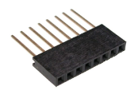

# Troubleshooting

## Specific issues with M5

- If, when using an M5StickC (or M5Stack), the ESP32 is unresponsive, upload fails etc. Make sure that you change the  environment to  on the status bar. Otherwise the default serial port in setup.h conflicts with the PSRAM of M5.

## Generic issues

Possible generic issues could be: improper wifi signal, unsupported protocol, unsupported GPIOs for Serial (stick to default RX2/TX2).

ESPAltherma generates logs on the main serial port (USB) and on the screen of the M5. Connect to the ESP32 and open the serial monitor on Platformio.

ESPAltherma also generates logs on MQTT. If Wifi and MQTT is not the issue, look at the logs on the topic `espaltherma/log`. You can see them on Home Assistant through  Configuration -> Integration -> MQTT -> Config -> Listen to a topic.

## Logs show 'Timeout on register' with value 0x15 0xea or 'Error 0x15 0xEA returned from HP'

`0x15 0xea` is the reply from the heatpump to say it does not understand the protocol.
If you have an older Altherma heat pump (around 2010 or before) it is probably using the older S protocol.
To activate it, at the end of `setup.h` change `#define PROTOCOL 'I'` to `#define PROTOCOL 'S'`
Also select the `def/PROTOCOL_S_ROTEX.h` or `def/PROTOCOL_S.h` definition file.

## Logs show 'Time out! Check connection' 'Wrong CRC on registry...'

This means that the communication is wrong. Usual suspects:

1. Un-conected GND: whatever you do, the GND of the ESP should always be connected to the GND of the Altherma. So, if you power your ESP with a USB charger (or your computer), make sure you also connect the GND from the ESP to your GND of the Altherma.
2. If not GND, then it's alway the Dupont cable. A faulty dupont cable is a VERY COMMON cause of issue. You can have a perfectly looking cable, they are not the best to do connection on the X10A connector (although much more common than an EH JST 5pin). So, change your cable. You can also use a common 2.54 female long header, plug it to the X10A connector and then your dupont cable to the long pins of the header.

## Note on voltage

The serial port of X10A is TTL 5V, where the ESP32 is 3.3V. Your ESP32 might not be 5V tolerant. If you want to play it safe, you should use a level shifter to convert Daikin TX - RX ESP line from 5V to 3.3V.

In practice, I had no problem connecting an ESP32 without level shifters. I also had no issue powering the ESP32 from the 5V line of the X10A. On my Daikin Altherma, 5V is provided by a 7805 with a massive heat sink, plus, there are not many clients for it on the board and the ESPAltherma running on my ESP32 consumes 70ma.

Some users reported that a ROTEX did not have a stable 5v that could be used to power the ESP32. If so, you would need to rely on an external 5V power supply (eg a regular USB charger) to power the ESP32.

If you are using an M5StickC you can select the PlatformIO env:m5stickc (or env_m5stickcplus for that version), then ESPAltherna will also report on the voltage and consumption of the M5StickC in the reported values.